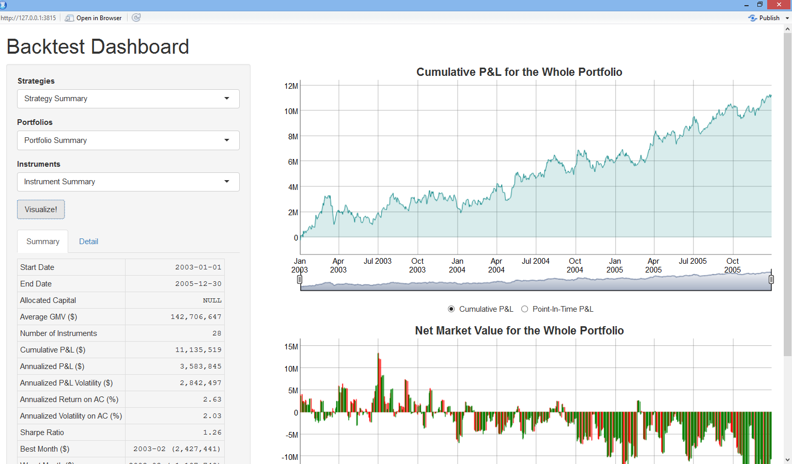

Authors
--------------------------------------------------------

David Kane, dave.kane at gmail.com

Ziqi Lu, ziqi.lu at williams.edu

Fan Zhang, fan.zhang at williams.edu

Miller Zijie Zhu, zijie.zhu at williams.edu

About
-----------------------------------------------------------------------

`backtestGraphics` package creates an interactive graphical interface to visualize backtest results
for different financial instruments, including but not limited to equities, futures, and credit default swaps. The package does
not run backtests, but instead displays the backtest results graphically. Available summary statistics include average gross market value, cumulative profit and loss, sharpe ratio, top three drawdowns, etc. Available plots include cumulative and point-in -time profit and loss, and gross and net market value, etc. `backtestGraphics` also support backtest results with different strategies, substrategies, and overlapping portfolios, if the necessary columns are provided. 

If you want to play with backtestGraphics, please visit [here](https://backtestgraphics.shinyapps.io/backtestGraphics)!

Maintainer
----------------------------------------------------------------------------------------------------
Miller Zijie Zhu, zijie.zhu at williams.edu
