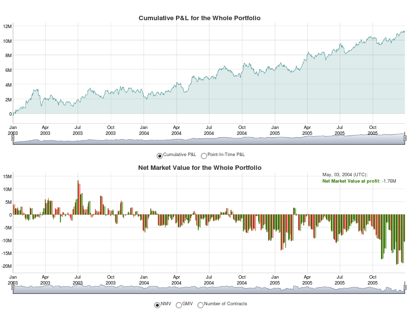
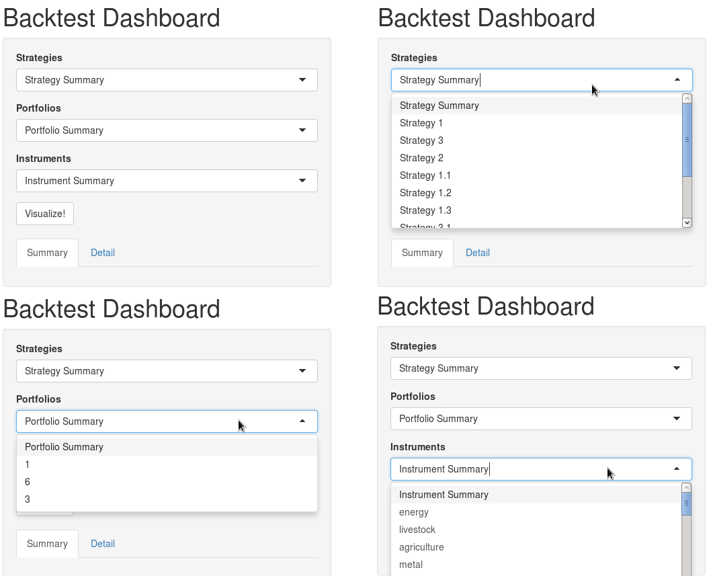

---
title: "Backtest Graphics"
tags:
- R
- backtesting
- visualization
date: "31 December 2024"
output: pdf_document
authors:
- name: Yanrong Song
  orcid: "0009-0003-5738-8384"
  email: yrsong129@gmail.com
  affiliation: 1
- name: Zijie Zhu
  email: zijie.miller.zhu@gmail.com
  affiliation: 1
- name: David Kane
  email: david.kane@gmail.com
  affiliation: 2
- name: Ziqi Lu
  email: ziqilu@g.harvard.edu
  affiliation: 2
- name: Karan Tibrewal
  email: karan.tibrewal@williams.edu
  affiliation: 3
- name: Fan Zhang
  email: fan.zhang@williams.edu
  affiliation: 3
bibliography: paper.bib
affiliations:
- name: Columbia University, United States
  index: 1
- name: Harvard University, United States
  index: 2
- name: Williams College, United States
  index: 3
---

# Summary

Backtesting is the process of testing trading strategies on prior time horizons to measure the effectiveness of a given strategy. It helps investors understand and optimize their trading strategies. The `backtestGraphics` package provides an interactive `Shiny` interface to visualize backtest results for a variety of financial instruments (equities, futures, and credit default swaps, among others)  (Chang et al. 2015). These visualizations enable users to employ their human perception to process a lot of backtest data quickly and approximately (Bostock 2012). 

It is important to note here that `backtestGraphics` doesn't run backtests, but instead provides graphical visualization of backtest results. To illustrate this subtle distinction, consider a simple trading strategy that buys the top 10 shares of the S&P 500, and shorts the bottom 10. Now, to test how the strategy performs historically, the user may use backtesting R packages like `backtest` (Campbell et al. 2008).The output from such backtesting is generally in the form of large dataframes which are difficult to interpret. As of such, the user may feed these dataframes, i.e. the holding data, to `backtestGraphics`. The package then constructs interactive `dygraph` plots, and calculates essential summary statistics which are easy to interpret and explore (Vanderkam and Allaire 2015). 

The `Shiny` interface returned by the package consists of a sidebar panel that includes a "Summary" and a "Detail" tab. The former provides the user with summary statistics, such as average gross market value (GMV), number of instruments, cumulative and annualized profit and loss (P&L), Sharpe ratio and best and worst performing months. The "Detail" tab provides information about the best and worst performers, as well as the biggest drawdowns. 

The main panel of the `Shiny` interface houses interactive plots for cumulative and point-in-time P&L, NMV, GMV and number of contracts. The user can learn the response variable at a given point in time for any of these plots by hovering the mouse on the specified point in time. Additionally, the user can also zoom into a time period by dragging the mouse. Radio buttons at the bottom of the plots allow the user to seamlessly switch between plots. Below is a screen shot of the plots: 

Additionally, to accommodate for more complex backtests, `backtestGraphics` allows the user to subset seamlessly between overlapping portfolios, and multiple strategies and sub-strategies. For example, suppose the user splits his portfolio into two halves: the first half trades using the aforementioned trading strategy on a weekly basis, while the second uses the same strategy on a bi-weekly basis. Although these strategies overlap every other week, the user may want to explore how a particular strategy does in isolation. In order to do so, the user simply has to select the appropriate options from the dropdown menus, and click visualize. 

In order to see `backtestGraphics` in action, please visit [here](https://backtestgraphics.shinyapps.io/backtestGraphics)!

# Statement of need

The `backtestGraphics` package provides an interactive graphical interface to visualize backtests results for a variety of financial instruments (equities, futures, credit default swaps, et cetera).
The `Shiny` interface, returned by the package, contains a sidebar panel with summary and detailed performance statistics, such as number of instruments, cumulative and annualized profit and loss, Sharpe ratio, top three drawdowns, and the three best and worst performers in the backtest. 
The main panel of interface houses interactive plots of profit and loss (P\&L), net market value (NMV) and gross market value (GMV). Lastly, the package also supports vizualization of multiple strategies, sub-strategies, and overlapping portfolios that may be present in a single backtest result. 

# Citations

Bostock, Mike. 2012. Time Series Visualization with Cubism.js. https://bost.ocks.org/mike/cubism/intro/#0.     
Campbell, Kyle, Jeffrey Enos, Daniel Gerlanc, and David Kane. 2008. “Backtests.” R News 7 (1).    
Chang, Winston, Joe Cheng, JJ Allaire, Yihui Xie, and Jonathan McPherson. 2015. Shiny: Web Application
Framework for R. http://CRAN.R-project.org/package=shiny.    
Vanderkam, Dan, and JJ Allaire. 2015. Dygraphs: Interface to Dygraphs Interactive Time Series Charting
Library. http://CRAN.R-project.org/package=dygraphs.    
